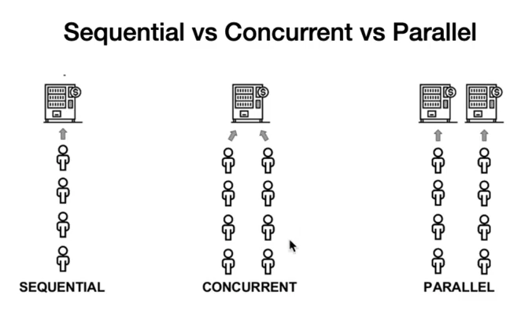

# Concurrency


- Sequential : การทำงานตามลำดับ ``sync``
- Concurrent : ยอมให้ทำงานพร้อมกันได้ ระหว่างที่มีอีกคนทำงานอยู่ ``goroutine``
- Parallel : มีการ set ในส่วนของการประมวณผลเพิ่มให้สามารถช่วยรับการทำงานมากขึ้น
    -   แต่จะต้องวางแผนในการ sync data ระหว่างตัวประมวณผลทั้ง 2 ตัวด้วย

> โดยปกติ Golang จะเจอ Sequential, Concurrent แต่ใน GO เองก็ยัง Support Parallel

## What's GO-routines
- Lightweight or Abstract thread : การแตก process ใน Single thread
- support resize stack : โดยปกติหลายๆภาษาจะมีขนาดของ stack ที่ fix size และมีขนาดใหญ่ แต่ในส่วนของ Golang จะเป็น tiny stack และยังสามารถทำการ resize ได้ด้วย ``stack คือพื้นที่การทำงานที่อยู่บน Thread `` โดยปกติ Stack จะถูกกำหนดขึ้นมาตอนเริ่มและไม่สามารถ resize ได้ แต่ให้ไปทำการ resize ที่ Heap แทน แต่ golang สามารถทำการ resize stack แบบ real time ได้
- สามารถยอมให้ทำงานพร้อมๆกันได้ บน 1 thread หรือการทำพร้อมๆกันหลายๆ go routines
- ใช้คำสั่ง ``go f(args)`` เพื่อทำการสร้าง routines
- go routines จะใช้ Channel ในการสื่อสารกันระหว่าง goroutines

## Chnnel

```golang
func main() {
	ch := make(chan int)

	// Put value to chanel
	ch <- 1

	// Recieve value from chanel
	fmt.Println(<-ch)

	time.Sleep(1 * time.Second)

	//go run1()
	//go run2()
}

-----  run ----
atal error: all goroutines are asleep - deadlock!
```

เนื่องจากเราทำการ run ที่ program หลักอันเดียวไม่มี routines อื่นๆ และไม่ได้มีการกำหนด buffer สำหรับ channel ดังนั้น ``ch <- 1`` จึงทำให้เกิด error ``fatal error: all goroutines are asleep - deadlock!`` โดยเราอาจจะแก้ โดยการกำหนด buffer ให้กับ channel ได้ ``ch := make(chan int, 1)``


> ``fatal error: all goroutines are asleep - deadlock!`` การที่เราแก้ปัญหา โดยการเพิ่ม buffer ซึ่งๆจริงมันไม่ใช่วิธีหรือสาเหตุที่แท้จริง ก็คือ ``golang จะไม่ยอมให้เกิดการ Block ใน main() โดยเด็ดขาดนั้นเอง ซึ่งการ put ค่าเข้า Channel ก็เป็นการ Block รูปแบบหนึ่งนั้นเอง``

วิธีแก้ก็คือเราต้องระหวังไม่ให้เกิดการ block การทำงานที่ Main() โดยเด็ดขาด

## Close
พอ เราทำการ run คำสั่ง close ก็คือจะเป็นการส่งค่า channel status เป็น false และจะมี value เป็นค่า default ของ channgel นั้นๆ