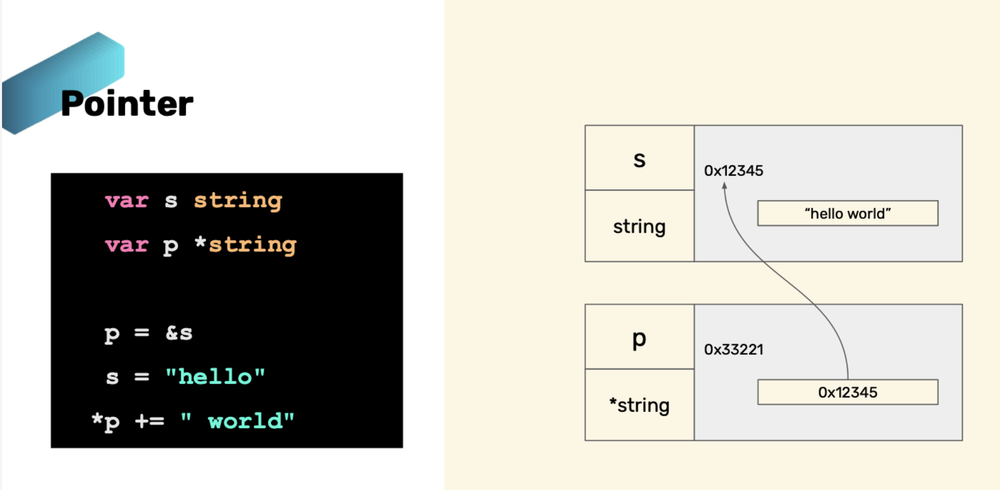
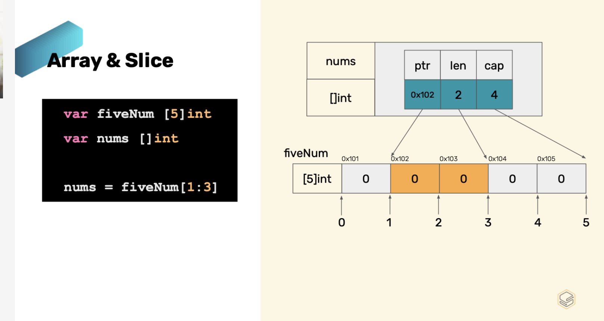
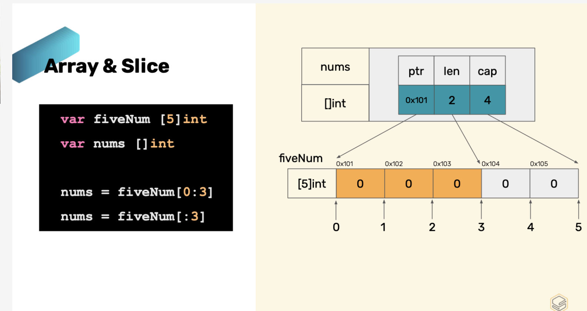
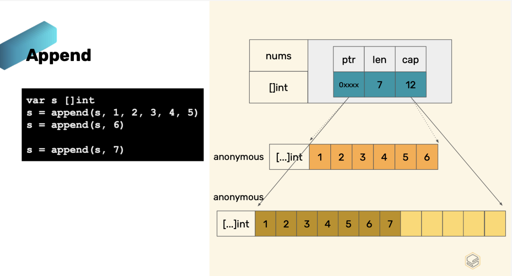

## variable
```go
    // Basic variable declaration
    var i int
    var a string
    var ok bool

    // decla and set default value
    var i int = 14
    var a string = "hello"
    var ok bool = true

    // Type inference
    var i = 14
    var a = "hello"
    var ok = true

    // Type inference in function only
    i := 14
    a := "hello"
    ok := true

```

## Constant
Constant is a immutable, เป็นการประกาศตัวแปลที่ไม่ต้องการให้มีการแก้ไขหลักจากการประกาศใช้งาน
```go
    const defaultValue int = 1
    const defaultValue2 = "value"

    const{
        errorCode = 1
        successCode = 2
    }
```
## if Else

```golang
    if n, err := strconv.Atoi("5s"); err != nil{

    }

    n, err := strconv.Atoi("5s");
    if err != nil{

    }else{

    }
```

## Loop

```golang
//A loop with 3 components
for i := 0; i < 10; i ++{

}

// A loop with a condition
for i < 10{

}

// An infinite loop
for{

}
ßßßß
```

## Basic types

```golang
bool

string

int int8 int16 int32 int64 // int+bit_value , int ถ้าไม่กำหนด bit จะมีขนาดเป็น 64
uint uint8 uint16 uint32 uint64 // uint+bit_value , uint ถ้าไม่กำหนด bit จะมีขนาดเป็น 64

byte // alias for uint8 

rune // alies for int32
     // represents a Unicode code point

float32 float64 
complex64 complex128
```

## Pointer



- `&s` get address of pointer
- `*string` ประกาศตัวแปล pointer
- `*p` กำหนดค่าให้ผ่าน pointer

## Zero Value, Array, and Slice

- ค่าสำหรับแต่ละ DataType ถ้าเราไม่ได้ทำการ Assign value
```golang
    number = 0
    string = ""
    boolean = false
    pointer = nil
```
## Array (immutable)
array ใน go จะเป็น immutable คือหลังจากกำหนด size ของ array แล้วจะไม่สามารถแก้ไข size ได้ ดังนั้นจะทำให้การใช้งานเราจะต้องรู้ขนาดของ size ที่ชัดเจนจึงจะสามารถใช้ได้อย่างมีประสิทธิภาพ

ดังนั้น go จึงได้มีการเตรียมในส่วนของ `Slice` เพื่อแก้ไขปัญหาดังกล่าว

```golang
    var fourNum [4]int

    fourNum[0] = 1
    fourNum[2] = 3

```

## Slice (mutable)

```golang
    var nums []int // zero vaule = nil

    nums = make([]int, 4) // Define memory

    nums[0] = 1
    nums[2] = 2

    nums = append(nums,20)

```

- `nums = make([]int, 4)` เราอาจจะกำหนดเป็น 0 ได้
- `nums = append(nums,20)` ใช้ในการเพิ่มค่าเข้าไป slide โดยจะเป็นการต่อท้าย

```golang
    make(ptr, len, cap)
    ptr => pointer of array
    len => Length of value
    cap => capacity

    // Demo
    nums = make([]int, 4, 6)

    // สร้าง slice ทีเป็น array int และ กำหนด len = 4, cap =6
    // เราจะได้ slice nums ที่มี value ตั้งต้น 4 ตัว แต่จะลองรับได้ 6 ตัว
    nums[0] => 0
    nums[1] => 0
    nums[2] => 0
    nums[3] => 0
    xx
    xx

```









